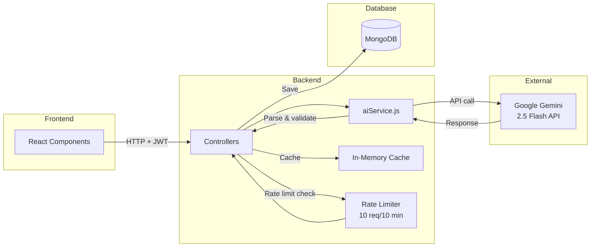
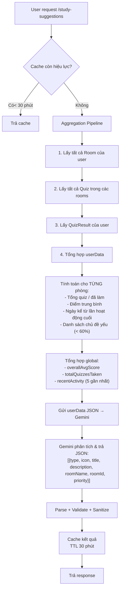

# 🤖 AI Integration — Kiến trúc & Giải thích thuật toán

## Tổng quan

AI StudyMate tích hợp **Google Gemini 2.5 Flash** thông qua package `@google/generative-ai` để cung cấp 5 tính năng AI chính. Tất cả đều sử dụng kỹ thuật **Prompt Engineering** để đảm bảo output chất lượng và nhất quán.


## Kiến trúc AI Service



## 5 Tính năng AI chi tiết

### 1. 💬 Chat AI (Hỏi đáp thông minh)

**Mục đích**: Trợ lý học tập hỏi đáp trong từng phòng học.

**Thuật toán / Logic**:
1. Nhận `message` + `conversationId` (tùy chọn) từ user
2. Tìm hoặc tạo `Conversation` object trong MongoDB
3. Lấy **20 tin nhắn gần nhất** làm context (sliding window)
4. Chuyển đổi history format: `assistant` → `model` (Gemini format)
5. Khởi tạo `chatSession` với `startChat({ history })`
6. Gửi message qua `sendMessage()` — Gemini tự duy trì ngữ cảnh
7. Lưu cả user message + AI response vào conversation

**System Prompt**:
```
Bạn là AI StudyMate — trợ lý học tập thông minh dành cho sinh viên Việt Nam.
- Trả lời bằng tiếng Việt, rõ ràng, dễ hiểu
- Giải thích từng bước khi giải bài tập  
- Khuyến khích tư duy, không chỉ đưa đáp án
- Sử dụng markdown để format câu trả lời
```

**Kỹ thuật**: Multi-turn conversation với sliding window (20 messages) để giữ context trong giới hạn token.

---

### 2. 📝 Tóm tắt bài học (Summarize)

**Mục đích**: Rút gọn văn bản dài thành các ý chính.

**Thuật toán / Logic**:
1. Validate input: text phải ≥ 50 ký tự
2. Xây dựng prompt với template cố định:
   - Yêu cầu tóm tắt ngắn gọn, giữ ý chính
   - Output dạng bullet points
   - Hỗ trợ đa ngôn ngữ (vi/en)
3. Gọi `generateContent(prompt)` — one-shot, không cần history
4. Trả về kết quả trực tiếp

**Kỹ thuật**: Single-shot generation với structured prompt template.

---

### 3. 🧠 Tạo Quiz tự động (AI Quiz Generation)

**Mục đích**: Tạo bộ câu hỏi trắc nghiệm từ chủ đề bất kỳ.

**Thuật toán / Logic**:
1. Nhận `topic` + `count` (1-15 câu), validate membership
2. Xây dựng prompt yêu cầu output **JSON array thuần**:
   ```json
   [{ "question": "...", "options": ["A","B","C","D"], "correctIndex": 0, "explanation": "..." }]
   ```
3. Gọi Gemini API
4. **Post-processing pipeline**:
   - Strip markdown code blocks (`\`\`\`json ... \`\`\``)
   - `JSON.parse()` — nếu lỗi → throw 502
   - Validate array structure
   - **Sanitize từng câu**: đảm bảo `options.length === 4`, `correctIndex ∈ [0,3]`
5. Lưu Quiz vào MongoDB
6. Emit Socket.IO event `quiz_created` để notify room members

**Kỹ thuật**: Constrained JSON generation + defensive parsing + fallback values.

---

### 4. 🔍 Giải thích Quiz (Explain Quiz Answer)

**Mục đích**: Phân tích chi tiết tại sao đáp án đúng/sai.

**Thuật toán / Logic**:
1. Nhận `{ question, options, correctIndex, userAnswer }`
2. Xây dựng prompt có cấu trúc:
   - Hiển thị câu hỏi + tất cả đáp án (A/B/C/D)
   - Đánh dấu đáp án đúng vs đáp án user chọn
   - Yêu cầu 4 phần: (1) Tại sao đúng, (2) Tại sao sai, (3) Mẹo ghi nhớ, (4) Kiến thức liên quan
3. Gọi `generateContent()` — one-shot
4. Trả kết quả dạng markdown

**Kỹ thuật**: Structured prompt với explicit output format requirements.

---

### 5. 💡 Gợi ý học tập cá nhân hóa (Study Suggestions)

**Mục đích**: Phân tích toàn bộ data học tập của user → tạo gợi ý cụ thể.

**Thuật toán / Logic** (phức tạp nhất):



**Data được gửi cho AI**:
```json
{
  "totalRooms": 5,
  "totalQuizzesTaken": 12,
  "overallAvgScore": 73,
  "rooms": [
    {
      "roomName": "Toán rời rạc",
      "subject": "Toán",
      "totalQuizzes": 3,
      "quizzesCompleted": 2,
      "avgScore": 65,
      "daysSinceLastActivity": 0,
      "weakTopics": ["Logic mệnh đề"]
    }
  ],
  "recentActivity": [
    { "topic": "...", "score": 3, "total": 5, "daysAgo": 1 }
  ]
}
```

**AI Output Types**:
| type | Ý nghĩa | Ưu tiên |
|---|---|---|
| `weak_subject` | Môn điểm thấp cần ôn | 🔴 high |
| `inactive_room` | Phòng lâu không vào | 🟡 medium |
| `streak` | Duy trì streak học tập | 🔥 medium |
| `improvement` | Gợi ý cải thiện | 📈 medium |
| `new_topic` | Thử chủ đề mới | 💡 low |

**Kỹ thuật**: Data aggregation pipeline → AI analysis → structured JSON output → in-memory caching (Map, TTL 30 phút).

---

## Bảo mật & Hiệu năng

| Biện pháp | Chi tiết |
|---|---|
| **Rate Limiting** | `express-rate-limit`: 10 requests / 10 phút cho mỗi IP |
| **Authentication** | Tất cả AI routes yêu cầu JWT valid |
| **Membership Check** | Kiểm tra user có trong phòng trước khi cho phép chat/quiz |
| **Input Validation** | Validate message length, topic, text trước khi gọi AI |
| **Response Sanitization** | Parse + validate JSON, substring title/description |
| **Caching** | In-memory cache cho study suggestions (30 min TTL) |
| **Error Handling** | Fallback values nếu AI trả format lỗi |
| **Lazy Initialization** | Gemini client chỉ khởi tạo khi cần (lazy init pattern) |
