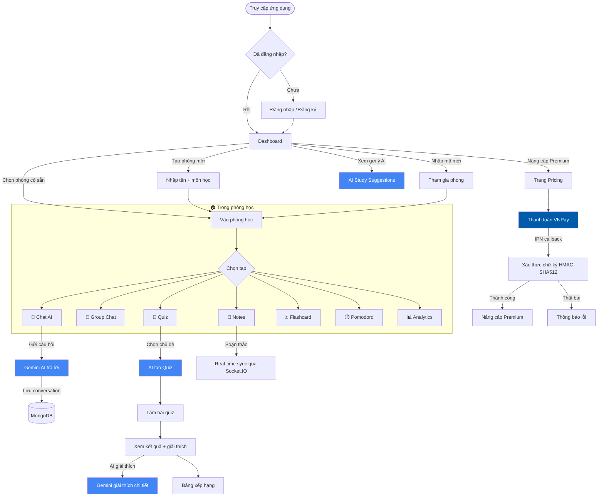
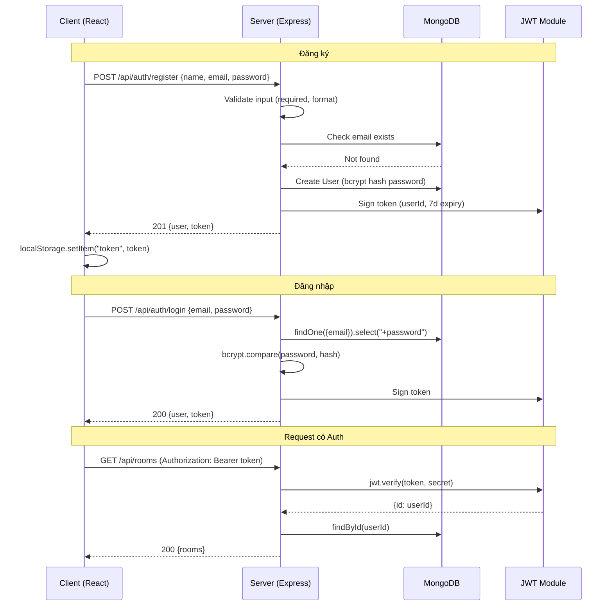
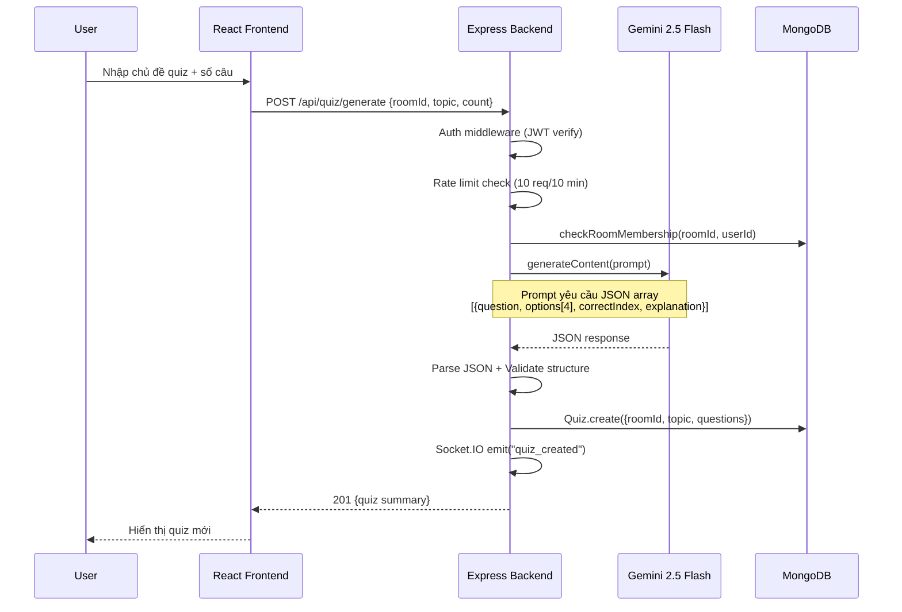
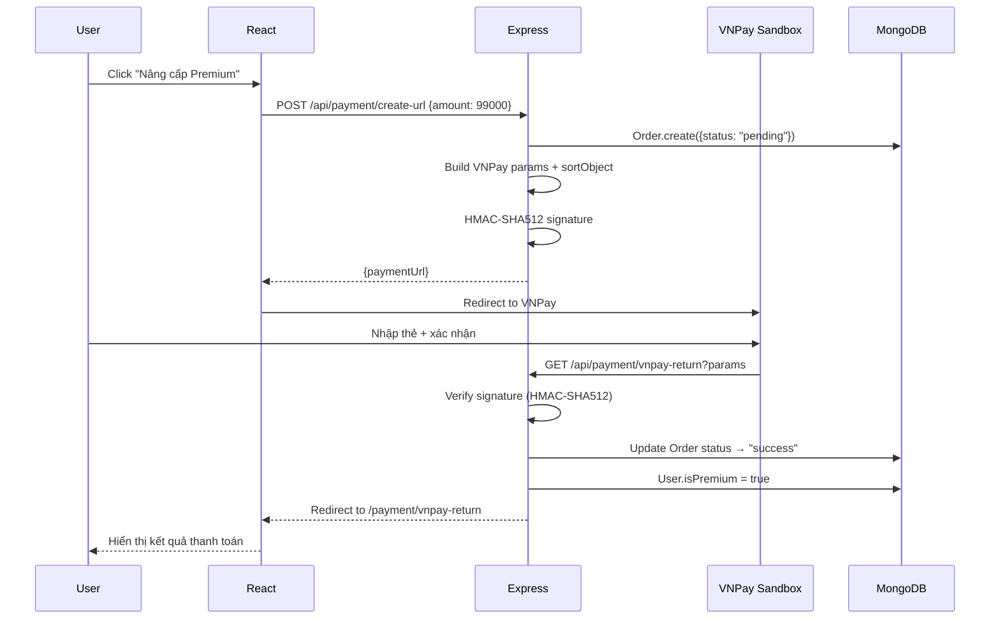

# 📋 Business Flow & Use-Case Diagrams

## 1. Use-Case Diagram

```mermaid
graph TB
    subgraph Actors
        S["🎓 Student<br/>(Free User)"]
        P["👑 Premium Student"]
        AI["🤖 Gemini AI"]
        VP["💳 VNPay Gateway"]
    end

    subgraph Authentication
        UC1["Đăng ký tài khoản"]
        UC2["Đăng nhập"]
        UC3["Quản lý hồ sơ"]
        UC4["Đổi mật khẩu"]
    end

    subgraph Room_Management["Room Management"]
        UC5["Tạo phòng học"]
        UC6["Tham gia phòng<br/>(mã mời)"]
        UC7["Quản lý thành viên<br/>(kick, chuyển quyền)"]
        UC8["Rời/Xóa phòng"]
    end

    subgraph Study_Tools["Study Tools"]
        UC9["Soạn ghi chú<br/>(real-time sync)"]
        UC10["Chat nhóm<br/>(Socket.IO)"]
        UC11["Flashcard Mode"]
        UC12["Pomodoro Timer"]
    end

    subgraph AI_Features["AI Features"]
        UC13["Chat AI hỏi đáp"]
        UC14["Tóm tắt bài học"]
        UC15["Tạo Quiz tự động"]
        UC16["Giải thích Quiz"]
        UC17["Gợi ý học tập<br/>cá nhân hóa"]
    end

    subgraph Quiz_System["Quiz System"]
        UC18["Làm bài quiz"]
        UC19["Xem bảng xếp hạng"]
        UC20["Xem analytics"]
        UC21["Xóa quiz"]
    end

    subgraph Payment["Payment & Premium"]
        UC22["Xem gói Premium"]
        UC23["Thanh toán VNPay"]
        UC24["Xem lịch sử<br/>thanh toán"]
    end

    S --> UC1 & UC2 & UC3 & UC4
    S --> UC5 & UC6 & UC8
    S --> UC9 & UC10 & UC11 & UC12
    S --> UC13 & UC14 & UC15 & UC16
    S --> UC18 & UC19 & UC20
    S --> UC22

    P --> UC7
    P --> UC17
    P --> UC23 & UC24

    AI --> UC13 & UC14 & UC15 & UC16 & UC17
    VP --> UC23

    style P fill:#FFD700,color:#000
    style AI fill:#4285F4,color:#fff
    style VP fill:#005BAA,color:#fff
```

## 2. Business Flow — Luồng nghiệp vụ chính

## 3. Authentication Flow

## 4. AI Quiz Generation Flow

## 5. Payment Flow (VNPay)

