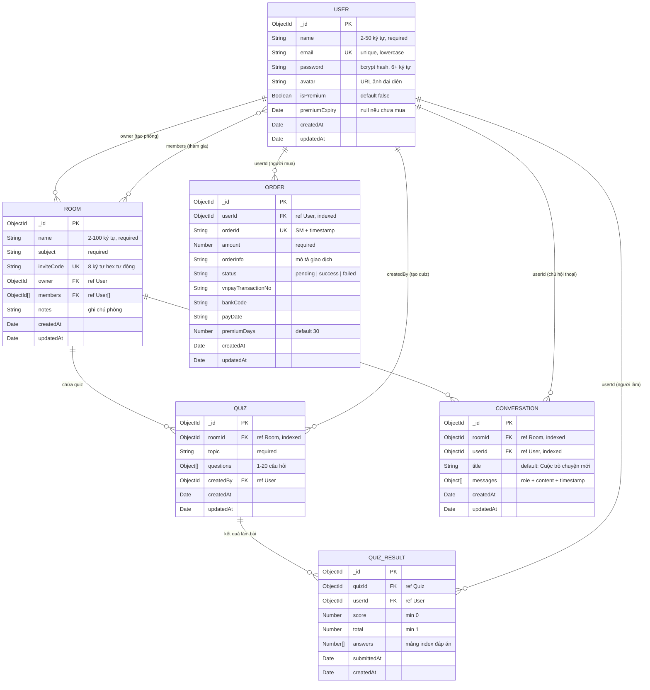

# 📊 Entity-Relationship Diagram (ERD)

## Sơ đồ quan hệ dữ liệu — AI StudyMate

## Mô tả quan hệ

| Quan hệ | Loại | Mô tả |
|---|---|---|
| User → Room (owner) | 1:N | Một user có thể sở hữu nhiều phòng |
| User ↔ Room (members) | N:M | Nhiều user tham gia nhiều phòng |
| Room → Quiz | 1:N | Một phòng có nhiều bộ quiz |
| User → Quiz (createdBy) | 1:N | Một user tạo nhiều quiz |
| Quiz → QuizResult | 1:N | Một quiz có nhiều kết quả |
| User → QuizResult | 1:N | Một user có nhiều kết quả quiz |
| Room → Conversation | 1:N | Một phòng có nhiều cuộc hội thoại AI |
| User → Conversation | 1:N | Một user có nhiều cuộc hội thoại |
| User → Order | 1:N | Một user có nhiều đơn thanh toán |

## Indexes

| Collection | Index | Loại | Mục đích |
|---|---|---|---|
| User | `email` | Unique | Đảm bảo email không trùng |
| Room | `inviteCode` | Unique | Đảm bảo mã mời không trùng |
| Quiz | `{ roomId: 1, createdAt: -1 }` | Compound | Query nhanh quiz theo phòng |
| QuizResult | `{ quizId: 1, userId: 1 }` | Compound Unique | Mỗi user chỉ nộp 1 lần/quiz |
| Conversation | `{ roomId: 1, userId: 1 }` | Compound | Query nhanh hội thoại |
| Order | `userId` | Single | Query đơn hàng theo user |

## Data Constraints (Validation)

| Field | Rule |
|---|---|
| User.name | 2-50 ký tự |
| User.email | Regex `^\S+@\S+\.\S+$` |
| User.password | ≥ 6 ký tự, bcrypt hash (salt 12) |
| Room.name | 2-100 ký tự |
| Quiz.questions | 1-20 câu, mỗi câu 4 options |
| Quiz.correctIndex | 0-3 |
| QuizResult.score | ≥ 0 |
| QuizResult.total | ≥ 1 |
| Order.status | enum: pending, success, failed |
