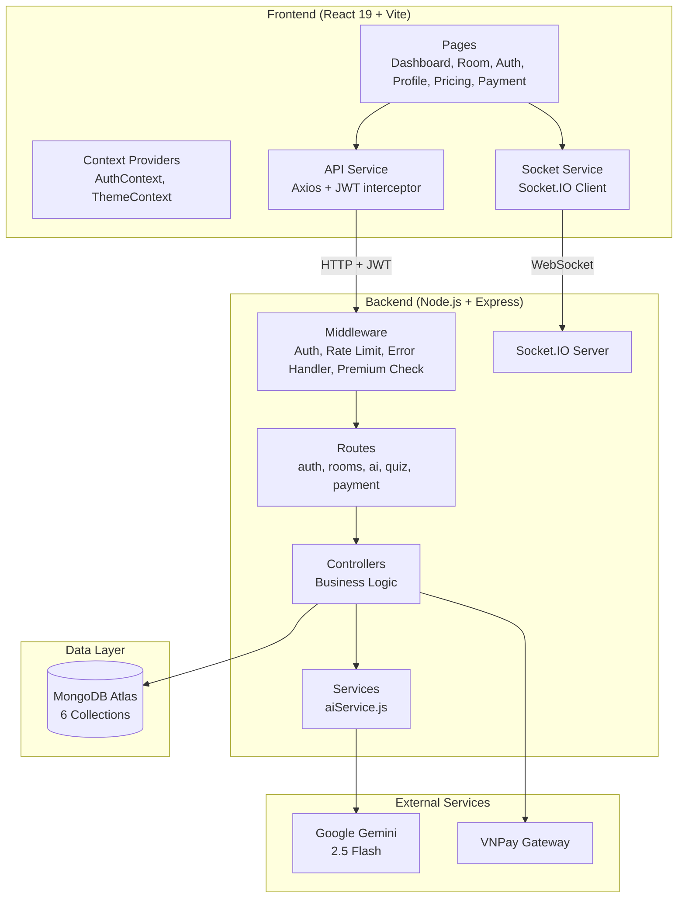

# 📄 BÁO CÁO DỰ ÁN — AI StudyMate

## Thông tin chung

| Mục | Chi tiết |
|---|---|
| **Tên dự án** | AI StudyMate — Nền tảng học nhóm thông minh |
| **Sinh viên** | Trần Kiên |
| **Repository** | [github.com/trankien022/studyMate](https://github.com/trankien022/studyMate) |
| **Công nghệ** | React 19 + Node.js/Express + MongoDB + Gemini AI + Socket.IO |

---

## 1. Yêu cầu hệ thống (Requirements)

### 1.1 Yêu cầu chức năng (Functional Requirements)

| STT | Chức năng | Mô tả | Trạng thái |
|---|---|---|---|
| F1 | Xác thực người dùng | Đăng ký, đăng nhập, JWT authentication | ✅ |
| F2 | Quản lý hồ sơ | Cập nhật tên, avatar, đổi mật khẩu | ✅ |
| F3 | Quản lý phòng học | Tạo, tham gia (mã mời), rời, xóa phòng | ✅ |
| F4 | Quản lý thành viên | Kick member, chuyển quyền chủ phòng | ✅ |
| F5 | Chat AI | Hỏi đáp với Gemini AI, lưu lịch sử, multi-turn | ✅ |
| F6 | Tóm tắt bài học | AI tóm tắt văn bản dài → bullet points | ✅ |
| F7 | Tạo Quiz AI | AI tạo quiz trắc nghiệm từ chủ đề bất kỳ | ✅ |
| F8 | Làm Quiz | Làm bài, chấm điểm tự động, bảng xếp hạng | ✅ |
| F9 | Giải thích Quiz AI | AI giải thích chi tiết đáp án đúng/sai | ✅ |
| F10 | Gợi ý học tập AI | Phân tích data → gợi ý cá nhân hóa | ✅ |
| F11 | Ghi chú phòng | Soạn thảo, lưu, sync real-time | ✅ |
| F12 | Chat nhóm | Tin nhắn real-time qua Socket.IO | ✅ |
| F13 | Flashcard | Chế độ ôn tập flashcard cho quiz | ✅ |
| F14 | Pomodoro Timer | Bộ đếm thời gian học tập | ✅ |
| F15 | Analytics | Thống kê: điểm TB, top performers, lịch sử | ✅ |
| F16 | Thanh toán VNPay | Nâng cấp Premium qua VNPay sandbox | ✅ |
| F17 | Lịch sử thanh toán | Xem lại các giao dịch | ✅ |

### 1.2 Yêu cầu phi chức năng (Non-Functional Requirements)

| Yêu cầu | Giải pháp |
|---|---|
| **Bảo mật** | JWT (7 ngày), bcrypt (salt 12), rate limiting |
| **Hiệu năng** | MongoDB indexes, AI response caching (30 min), pagination |
| **Khả dụng** | Error boundary (React), global error handler (Express) |
| **Responsive** | CSS responsive cho desktop, tablet, mobile |
| **Real-time** | Socket.IO cho chat nhóm, sync notes, notifications |

---

## 2. Thiết kế hệ thống (System Design)

### 2.1 Kiến trúc tổng quan



### 2.2 Mô hình MVC

| Layer | Thư mục | Vai trò |
|---|---|---|
| **Model** | `src/models/` | 6 Mongoose schemas: User, Room, Quiz, QuizResult, Conversation, Order |
| **Controller** | `src/controllers/` | 5 controllers: auth, room, quiz, ai, payment |
| **View** | `frontend/src/` | React components, pages, contexts |
| **Route** | `src/routes/` | 5 route files mapping URL → controller |
| **Middleware** | `src/middleware/` | 6 middleware: auth, asyncHandler, checkMembership, checkPremium, errorHandler, rateLimit |
| **Service** | `src/services/` | aiService.js (Gemini integration) |

### 2.3 Cấu trúc thư mục

```
ai-studymate/
├── src/                          # Backend
│   ├── controllers/              # 5 controllers (business logic)
│   ├── models/                   # 6 Mongoose schemas
│   ├── routes/                   # 5 route definitions
│   ├── middleware/                # 6 middleware functions
│   ├── services/                 # AI service (Gemini)
│   ├── sockets/                  # Socket.IO handlers
│   └── server.js                 # Entry point
├── frontend/src/                 # Frontend (React/Vite)
│   ├── pages/                    # 7 page components
│   │   └── Room/tabs/            # 7 tab components
│   ├── contexts/                 # Auth, Theme providers
│   ├── services/                 # API + Socket services
│   └── components/               # Shared components
├── docs/                         # Documentation
│   ├── ERD.md                    # Entity-Relationship Diagram
│   ├── BUSINESS_FLOW.md          # Business flow diagrams
│   ├── AI_INTEGRATION.md         # AI architecture & algorithms
│   └── REPORT.md                 # This report
├── seed-data.js                  # Sample data (30 users, 12 rooms)
└── README.md                     # Setup guide
```

---

## 3. Thiết kế cơ sở dữ liệu

### 3.1 Danh sách collections

| Collection | Số trường | Quan hệ | Mục đích |
|---|---|---|---|
| **User** | 7 | FK → Room, Order, Quiz, Conversation | Người dùng |
| **Room** | 7 | FK → User (owner, members) | Phòng học |
| **Quiz** | 6 | FK → Room, User | Bộ câu hỏi |
| **QuizResult** | 7 | FK → Quiz, User | Kết quả làm bài |
| **Conversation** | 5 | FK → Room, User | Lịch sử chat AI |
| **Order** | 10 | FK → User | Đơn thanh toán VNPay |

### 3.2 Sơ đồ ERD
→ Xem chi tiết tại [docs/ERD.md](./ERD.md)

### 3.3 Normalization
- **Không trùng lặp dữ liệu**: Sử dụng ObjectId references thay vì nhúng toàn bộ
- **Indexes tối ưu**: Compound indexes cho query performance
- **Unique constraints**: email (User), inviteCode (Room), orderId (Order), quizId+userId (QuizResult)

### 3.4 Sample Data
File `seed-data.js` tạo:
- 30 users (tên Việt Nam thực tế, 8 Premium)
- 12 rooms (đa dạng 12 môn học, 8-12 thành viên mỗi phòng)
- 15 quizzes (4-5 câu/quiz, 11 chủ đề khác nhau)
- ~60+ quiz results (40-80% members đã làm)
- 8 AI conversations mẫu

---

## 4. Các chức năng chính

### 4.1 Xác thực & Phân quyền
- **Đăng ký/Đăng nhập** → JWT token (7 ngày), bcrypt hash (salt 12)
- **Bảo vệ route** → `auth` middleware verify JWT trên mọi request
- **Kiểm tra membership** → `checkMembership` middleware kiểm tra user trong phòng
- **Premium gate** → `checkPremium` middleware cho tính năng Premium

### 4.2 Quản lý phòng học
- **CRUD**: Tạo / Xem / Cập nhật notes / Xóa (cascade delete quiz + results + conversations)
- **Mời**: Mã mời 8 ký tự hex tự động sinh (crypto.randomBytes)
- **Quản lý**: Kick member, chuyển quyền owner, rời phòng
- **Pagination**: Hỗ trợ phân trang (page, limit, totalPages)

### 4.3 Quiz System
- **AI Generation**: Gemini tạo quiz từ chủ đề → JSON parse → validate → save
- **Làm bài**: Submit answers → chấm điểm tự động → lưu result
- **Leaderboard**: Xếp hạng theo điểm giảm dần
- **Analytics**: Tổng quiz, tổng attempts, điểm TB, top performers
- **AI Explain**: Giải thích chi tiết từng câu sai

### 4.4 Real-time Features (Socket.IO)
- **Group Chat**: Gửi/nhận tin nhắn real-time
- **Notes Sync**: Đồng bộ ghi chú khi team edit
- **Notifications**: Quiz mới, member join/leave

### 4.5 Thanh toán VNPay
- **Tạo URL**: Build params → sortObject → HMAC-SHA512 signature → redirect VNPay
- **IPN Callback**: Server-to-server verification → update order + upgrade premium
- **Return URL**: Fallback verification + redirect frontend
- **Lịch sử**: Xem lại 20 giao dịch gần nhất

---

## 5. Tích hợp AI

→ Xem chi tiết tại [docs/AI_INTEGRATION.md](./AI_INTEGRATION.md)

**Tóm tắt**: 5 tính năng AI sử dụng Google Gemini 2.5 Flash:
1. **Chat AI** — Multi-turn conversation, sliding window 20 messages
2. **Summarize** — One-shot text summarization với structured prompt
3. **Quiz Generation** — Constrained JSON generation + defensive parsing
4. **Quiz Explanation** — Structured analysis (đúng/sai/mẹo/kiến thức)
5. **Study Suggestions** — Data aggregation pipeline → AI analysis → caching

---

## 6. Bảo mật

| Biện pháp | Triển khai |
|---|---|
| **Password hashing** | bcrypt, salt rounds = 12 |
| **JWT Authentication** | Signed tokens, 7-day expiry |
| **Password hidden** | `select: false` trên User.password |
| **Input validation** | Mongoose schema + controller-level checks |
| **Rate limiting** | 10 requests / 10 phút cho AI endpoints |
| **Membership check** | Verify user trong room trước mỗi action |
| **CORS** | Configured cho frontend origin |
| **Error handling** | Global error handler, không leak stack traces |
| **VNPay signature** | HMAC-SHA512 verification cho payment callbacks |
| **Environment vars** | Secrets trong .env, .gitignore protected |

---

## 7. Công nghệ sử dụng

### Frontend
| Công nghệ | Mục đích |
|---|---|
| React 19 | UI framework |
| Vite 8 | Build tool & dev server |
| React Router DOM 7 | Client-side routing |
| Axios | HTTP client + JWT interceptor |
| Socket.IO Client 4.8 | Real-time communication |
| Lucide React | Icon library |
| React Hot Toast | Toast notifications |
| React Markdown | Render AI markdown responses |

### Backend
| Công nghệ | Mục đích |
|---|---|
| Node.js + Express 4.22 | REST API server |
| MongoDB + Mongoose 9.3 | Database & ODM |
| Google Generative AI 0.24 | Gemini AI integration |
| Socket.IO 4.8 | Real-time WebSocket server |
| JWT + bcryptjs | Authentication & encryption |
| Express Rate Limit 8.3 | API rate limiting |
| qs | VNPay query string handling |

---

## 8. Hướng dẫn chạy dự án

### Yêu cầu
- Node.js v18+
- MongoDB Atlas account
- Google Gemini API Key
- VNPay Sandbox credentials (tùy chọn)

### Cài đặt
```bash
git clone https://github.com/trankien022/studyMate.git
cd studyMate
npm install          # Backend
cd frontend && npm install && cd ..  # Frontend
```

### Cấu hình `.env`
```env
PORT=5000
MONGODB_URI=your_mongodb_uri
JWT_SECRET=your_jwt_secret
GEMINI_API_KEY=your_gemini_api_key
VNPAY_TMN_CODE=your_vnpay_code
VNPAY_HASH_SECRET=your_vnpay_secret
VNPAY_URL=https://sandbox.vnpayment.vn/paymentv2/vpcpay.html
VNPAY_RETURN_URL=http://localhost:5000/api/payment/vnpay-return
FRONTEND_URL=http://localhost:5173
```

### Chạy
```bash
npm run dev          # Backend (port 5000)
cd frontend && npm run dev  # Frontend (port 5173)
npm run seed         # Tạo dữ liệu mẫu
```

---

## 9. Tài liệu tham khảo

| Tài liệu | Link |
|---|---|
| ERD Diagram | [docs/ERD.md](./ERD.md) |
| Business Flow | [docs/BUSINESS_FLOW.md](./BUSINESS_FLOW.md) |
| AI Integration | [docs/AI_INTEGRATION.md](./AI_INTEGRATION.md) |
| API Endpoints | [README.md](../README.md) |
| VNPay Docs | [sandbox.vnpayment.vn](https://sandbox.vnpayment.vn/apis/docs/thanh-toan-pay/pay.html) |
| Gemini AI Docs | [ai.google.dev](https://ai.google.dev/docs) |
